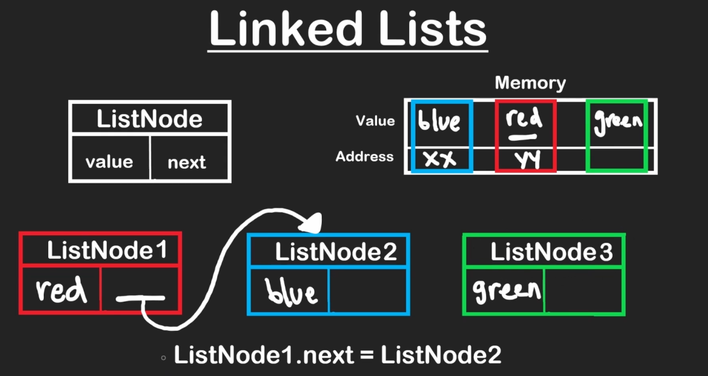
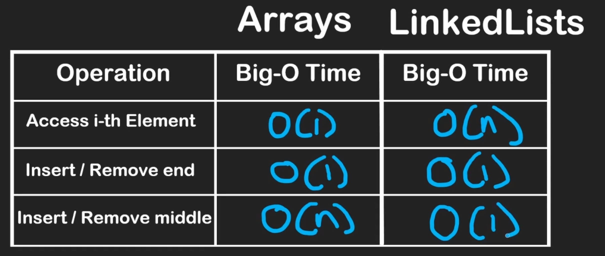

# Linked List

The size of arrays need to be specified before it can be used, therefore we need a data structure that can store elements of same type without the size being specified beforehand. Linked list does exactly the same.

- Insering/Deleting an element at start/end is O(1) [Assuming we have both head & tail pointers]
- Inserting/Deleting an element in a linked list is O(1) [Assuming the pointers to the previous noed & next node of the node to be deleted are given]
- Accessing an element from a linked list is O(n)

## PROBLEMS

### Singly linked list 

https://leetcode.com/problems/reverse-linked-list/

https://leetcode.com/problems/merge-two-sorted-lists/

### Doubly linked list

https://leetcode.com/problems/design-linked-list/

https://leetcode.com/problems/design-browser-history/

### Queues

https://leetcode.com/problems/number-of-students-unable-to-eat-lunch/

https://leetcode.com/problems/implement-stack-using-queues/