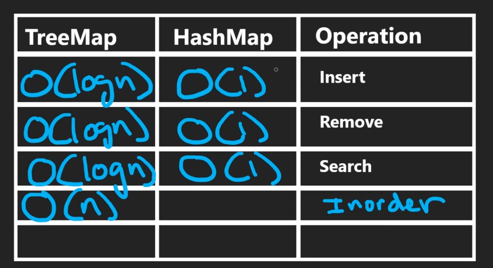

# Hashing

- Hash set / unordered set is implemeneted using hashing
- Insertion into as hash set is O(1) operation
- Hash collisions can be handled using many ways like Chaining, Open Addressing
- The higher the size of the hash table the lesser the number of collisions
- If the size of hash table is prime number, the number of collisions will less

## PROBLEMS

<h6>Usage</h6>

- https://leetcode.com/problems/contains-duplicate/
- https://leetcode.com/problems/two-sum/
- https://leetcode.com/problems/lru-cache/

<h6>Implementation</h6>

- https://leetcode.com/problems/design-hashset/
- https://leetcode.com/problems/design-hashmap/